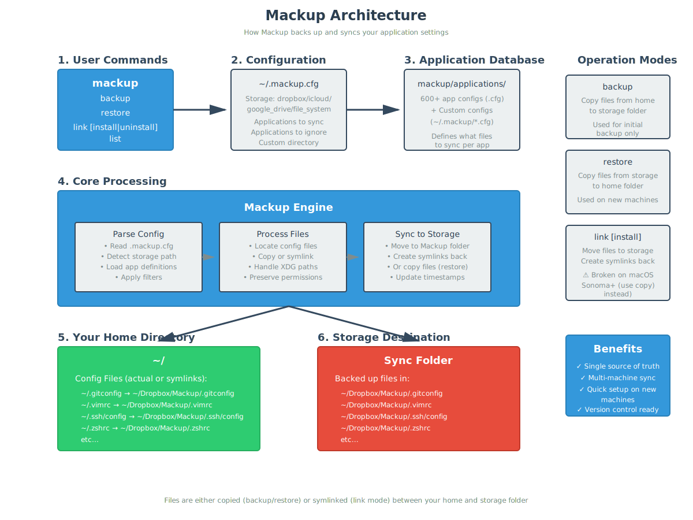

# Mackup Architecture

This document explains how Mackup works internally to help contributors
understand the codebase.

## Visual Overview



## Core Concepts

Mackup is a tool that backs up and syncs application configuration files
across multiple machines using a cloud storage service (Dropbox, Google Drive,
iCloud) or any file system location.

### Operation Modes

Mackup has two main operation modes:

#### 1. Copy Mode (Recommended)

Copy mode is used for backing up and restoring files:

- **`mackup backup`**: Copies configuration files from your home directory
  to the Mackup folder
- **`mackup restore`**: Copies configuration files from the Mackup folder
  back to your home directory

This is a one-time operation used when setting up a new machine or creating
an initial backup.

#### 2. Link Mode (Legacy - Not recommended for macOS Sonoma+)

Link mode creates persistent symlinks between your home directory and the
Mackup folder:

- **`mackup link install`**: Moves files to Mackup folder and creates
  symlinks back to original locations
- **`mackup link`**: Creates symlinks from Mackup folder to home directory
  (on additional machines)
- **`mackup link uninstall`**: Removes symlinks and copies files back to
  original locations

⚠️ **Warning**: Link mode is broken on macOS Sonoma (14) and later due to
changes in how macOS handles symlinked preferences. Use copy mode instead.

## Component Architecture

### 1. Command Line Interface (`main.py`)

Entry point for the application. Parses command-line arguments using
`docopt` and dispatches to the appropriate operation.

**Key Functions:**

- Argument parsing and validation
- Help text display
- Operation dispatch

### 2. Configuration Manager (`config.py`)

Reads and parses the `.mackup.cfg` configuration file.

**Configuration Sources (in order of precedence):**

1. `~/.mackup.cfg`
2. `$MACKUP_CONFIG` environment variable
3. `$XDG_CONFIG_HOME/mackup/mackup.cfg` or `~/.config/mackup/mackup.cfg`

**Configuration Options:**

- Storage engine (dropbox, google_drive, icloud, file_system)
- Storage path and directory name
- Applications to sync/ignore
- Custom directory name

### 3. Application Database (`appsdb.py`)

Manages the database of supported applications and their configuration files.

**Sources:**

- Built-in application configs (`mackup/applications/*.cfg`)
- User-defined custom configs (`~/.mackup/*.cfg`)

**Application Config Format:**

```ini
[application]
name = Application Name

[configuration_files]
.config_file
folder/

[xdg_configuration_files]
app/config
```

### 4. Application Handler (`application.py`)

Handles the operations (backup, restore, link) for individual applications.

**Key Operations:**

- File discovery and validation
- Copy operations with permission preservation
- Symlink creation and management
- XDG directory handling
- Conflict detection

### 5. Core Engine (`mackup.py`)

Orchestrates the overall backup/restore/link operations across all
applications.

**Workflow:**

1. Load configuration
2. Determine storage location
3. Load application database
4. Filter applications based on config
5. Execute operation on each application
6. Handle errors and report status

### 6. Utilities (`utils.py`)

Common utility functions used throughout the codebase:

- File system operations (copy, delete, symlink)
- Path manipulation and resolution
- XDG directory detection
- Error handling and user prompts
- Storage engine detection (Dropbox, Google Drive, iCloud)

## Data Flow

### Backup Flow

```text
User runs: mackup backup
    ↓
main.py parses command
    ↓
config.py loads .mackup.cfg
    ↓
appsdb.py loads application definitions
    ↓
mackup.py iterates through applications
    ↓
application.py for each app:
    - Finds config files in home directory
    - Copies to Mackup storage folder
    - Preserves permissions and timestamps
    ↓
Files now in: ~/Dropbox/Mackup/ (or chosen storage)
```

### Restore Flow

```text
User runs: mackup restore
    ↓
main.py parses command
    ↓
config.py loads .mackup.cfg
    ↓
appsdb.py loads application definitions
    ↓
mackup.py iterates through applications
    ↓
application.py for each app:
    - Finds files in Mackup storage folder
    - Copies to home directory
    - Preserves permissions and timestamps
    ↓
Config files now in home directory
```

### Link Install Flow (Legacy)

```text
User runs: mackup link install
    ↓
main.py parses command
    ↓
config.py loads .mackup.cfg
    ↓
appsdb.py loads application definitions
    ↓
mackup.py iterates through applications
    ↓
application.py for each app:
    - Moves config files to Mackup storage folder
    - Creates symlinks from original location to storage
    ↓
Files in storage: ~/Dropbox/Mackup/
Symlinks in home: ~/.config → ~/Dropbox/Mackup/.config
```

## Key Design Decisions

### 1. Symlinks vs Copies

**Original Design (Link Mode):**

- Symlinks allowed real-time sync across machines
- Changes immediately reflected in cloud storage
- Single source of truth

**Current Recommendation (Copy Mode):**

- macOS Sonoma+ broke symlink support for preferences
- Copy mode is more reliable across platforms
- Trade-off: manual sync required (re-run backup/restore)

### 2. Application Database

- **Centralized definitions**: All supported apps in
  `mackup/applications/`
- **User extensibility**: Custom apps via `~/.mackup/*.cfg`
- **Simple format**: INI-style configuration files
- **Override capability**: User configs override built-in ones

### 3. Storage Abstraction

- **Multiple backends**: Dropbox, Google Drive, iCloud, file system
- **Auto-detection**: Automatically finds storage paths
- **Flexibility**: Custom paths for any sync solution

### 4. XDG Support

- **Standards compliance**: Respects XDG Base Directory Specification
- **Flexibility**: Handles non-standard `$XDG_CONFIG_HOME`
- **Separate section**: `[xdg_configuration_files]` in app configs

## File Structure

```text
mackup/
├── main.py              # CLI entry point
├── mackup.py           # Core orchestration engine
├── config.py           # Configuration management
├── appsdb.py           # Application database
├── application.py      # Per-application operations
├── utils.py            # Utility functions
├── constants.py        # Constants and defaults
└── applications/       # Built-in app configs
    ├── git.cfg
    ├── vim.cfg
    ├── ssh.cfg
    └── ... (600+ more)
```

## Extension Points

### Adding a New Application

Create `mackup/applications/myapp.cfg`:

```ini
[application]
name = My Application

[configuration_files]
.myapprc
.myapp/

[xdg_configuration_files]
myapp/config.yml
```

Submit PR with the new config file.

### Adding a New Storage Backend

1. Extend `config.py` to detect new storage location
2. Add storage type to `constants.py`
3. Implement path detection in `utils.py`
4. Update documentation

### Custom File Sync

Users can sync any files by creating `~/.mackup/custom.cfg`:

```ini
[application]
name = My Custom Files

[configuration_files]
.custom_file
custom_directory/
```

## Testing Strategy

The codebase includes comprehensive unit tests:

- **`tests/test_application.py`**: Application operations
- **`tests/test_config.py`**: Configuration parsing
- **`tests/test_utils.py`**: Utility functions
- **`tests/test_cli.py`**: Command-line interface
- **`tests/test_main.py`**: Main entry point

Tests use temporary directories and mock file systems to avoid affecting
the actual system.

## Error Handling

Mackup includes several safety mechanisms:

1. **Confirmation prompts**: Asks before destructive operations
2. **Conflict detection**: Warns if files exist in both locations
3. **Dry-run capability**: Can preview operations (future enhancement)
4. **Graceful degradation**: Continues with other apps if one fails
5. **Clear error messages**: Helps users understand what went wrong

## Performance Considerations

- **Sequential processing**: Processes one application at a time
- **File-by-file operations**: No batch operations for reliability
- **No caching**: Reads fresh data on each run
- **Minimal dependencies**: Only requires `docopt-ng` for CLI parsing

## Future Enhancements

Potential improvements to the architecture:

1. **Progress indicators**: Show progress during long operations
2. **Dry-run mode**: Preview changes without executing
3. **Incremental sync**: Only sync changed files
4. **Parallel processing**: Speed up operations on multi-app backups
5. **Conflict resolution**: Better handling of file conflicts
6. **Rollback capability**: Undo operations if something goes wrong

## Contributing

See [CONTRIBUTING.md](../.github/CONTRIBUTING.md) and
[develop.md](develop.md) for guidelines on contributing to Mackup.
